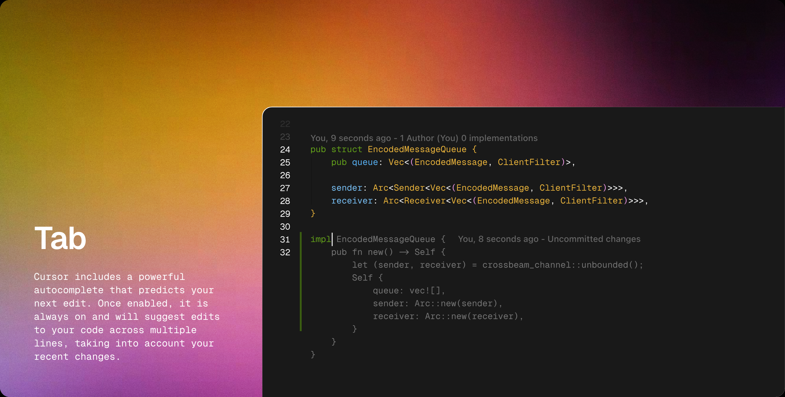
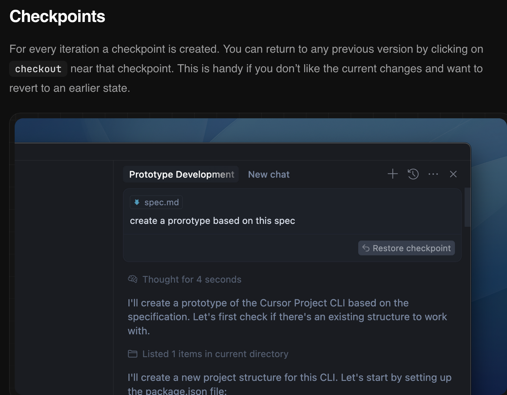

# AI-Powered Spring Boot Workshop

Welcome to this interactive workshop on leveraging cutting-edge AI tools in software development! This repository contains a Spring Boot application that demonstrates how artificial intelligence can simplify programming and tackle real-world IT challenges.

## About the Workshop

During this hands-on session, you'll participate in live coding demonstrations using state-of-the-art AI tools. Our experienced lecturers will guide you through practical examples that showcase how AI can revolutionise your development workflow and inspire your future career in technology.

1. Intro (10 min)
2. Coding Session (30 min)
3. Groups Present (5 min each)
4. Closing (5 min)

## App Overview

The application is a template for a simple "Bubble E-Shop". We will be using AI to integrate several new features. Each group will change the E-Shop from "Bubbles" to the their choice of product.

## Getting Started

### Prerequisites

- Java 23 or higher
- Gradle 8.x
- cursor.ai
- A sense of humour and curiosity about AI

<!-- ### Configuration

The application uses Spring AI with OpenAI integration. You'll need to configure your API keys in the `application.properties` file:

```properties
spring.ai.openai.api-key=your-api-key-here
``` -->

### Running the Application

1. Clone this repository:

   ```bash
   git clone https://github.com/yourusername/springbootai.git
   cd springbootai
   ```

2. Build the project:

   ```bash
   ./gradlew build
   ```

3. Run the application:

   ```bash
   ./gradlew bootRun
   ```

4. The application will start on http://localhost:8080/bubbles

## Workshop TODOs

During the workshop, we'll be enhancing this application by exploring the following [Cursor features](https://www.cursor.com/features):

### 1. Understand the codebase

Using the **Chat** feature, ask the AI to describe the codebase.

Use `@Codebase` to set the context, ask the AI questions about your codebase. Cursor will search your codebase to find relevant code to your query. You can ask something like: `Describe this codebase to me.`

Feel free to ask follow-up questions or other specifics until you are ready to move on.


### 2. Add three new items to the database

Using the **Tab Completion** feature, add three new items to the database by editing the following file:

`src/main/java/ibm/com/demo/springbootai/config/DatabaseConfig.java`



### 3. Add a Reviews page

Using the AI Chat feature, have Cursor add a reviews page. Make sure to reference the codebase or relevant files:

`@Codebase Add a reviews page to this application.`

**Review the code before accepting!!!**

Relying on AI without understand the generated code will cause severe issues as the application grows more complex or bugs need fixing.

### 4. Modify the website from bubbles to your teams choice of product

Using the AI Compose/Agent feature, ask the AI to change from bubbles to your product of choice. You will need to get new images from the web.


### 5. Create an About page

Using any of the Cursor features, create an **About Page** for your E-Shop.

### 6. Implement "Add to Cart" functionality and page

Using any of the Cursor features, allow the user to add items to their cart, and view the items in a new page.

### 7. BONUS: Create an API to use Google's GenAI for image generation

Using any of the Cursor features, create an API to generate new images for your products with [Google Imagen](https://ai.google.dev/gemini-api/docs/imagen-prompt-guide).

If you run into any issues or want to undo changes, be sure use the **Checkpoints** feature.



### 8. BONUS: Create an API to use Google's GenAI for image captioning

Using any of the Cursor features, create an API to describe the new images with [Google Image Captioning](https://ai.google.dev/gemma/docs/capabilities/vision/image-interpretation#:~:text=You%20can%20use%20Gemma%203,the%20context%20from%20visual%20information.).

Send these new captions to your image generation API to create another set of products.

## Why This Matters

AI isn't just a buzzword—it's transforming how we approach software development. By the end of this workshop, you'll have practical experience with AI tools that can:

- Accelerate your coding workflow
- Solve complex problems more efficiently
- Generate creative solutions you might not have considered

Whether you're a coding novice or a seasoned developer, these skills will be invaluable in your future tech career.

## A Note to Students

This workshop is designed to be both educational and entertaining. We believe learning works best when it's enjoyable! While we'll maintain professional standards, expect a few laughs along the way as we explore the occasionally unpredictable world of AI.

Remember: The robots are here to help us, not replace us... at least for now! 😉

## Questions?

Feel free to raise your hand during the workshop or submit issues in this repository. Happy coding!
